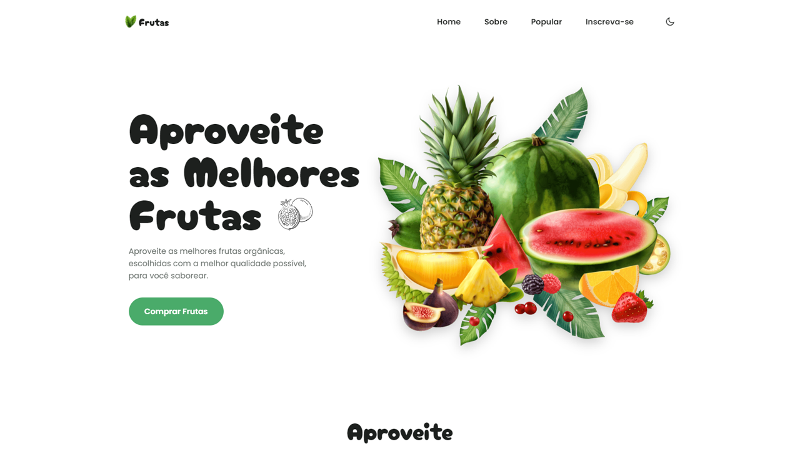

  

# 🍉 Frutas Website
Projeto de um site de venda de frutas orgânicas. Nesse projeto eu aproveitei para praticar bastante CSS e a minhas skills de responsividade.

## ⚙️ Funcionalidades

- [x] Site totalmente responsivo e intuitivo;
- [x] Site com animações para aprimorar a experiência do usuário;
- [x] Possui uma setinha para voltar ao topo;
- [x] Projeto segue os conceitos de Ui/Ux Design;
- [x] Ao rolar o site a sessão ativa fica em verde para mostrar onde o usuário está;
- [x] Menu mobile;

## 🚀 Tecnologias

- [HTML](https://www.w3schools.com/html/)
- [CSS](https://developer.mozilla.org/pt-BR/docs/Web/CSS)
- [JavaScript](https://developer.mozilla.org/pt-BR/docs/Web/JavaScript)

## 📝 Considerações

Depois desse projeto e outras práticas aprimorei muito meu CSS;
